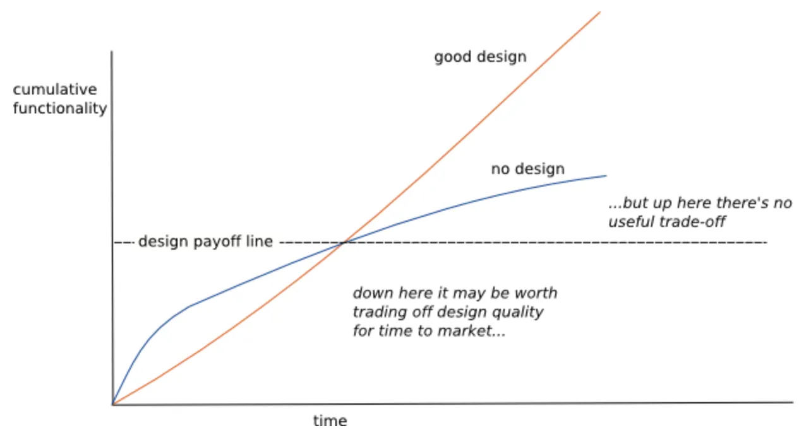

- 리펙터링 원칙
  **리펙터링 정의**
  - 명사: 소프트웨어의 겉보기 동작은 그대로 유지한채, 코드를 이해하고 수정하기 쉽도록 내부 구조를 변경하는 기법
  - 동사: 소프트웨어의 겉보기 동작은 그대로 유지한채, 여러가지 리펙터링 기법을 적용해서 소프트웨어를 재구성하다
    → 누군가 리펙터링하다가 코드가 깨져서 며칠이나 고생했다라고 한다면 십중팔구 리펙터링한 것이 아니다
    **두개의 모자**
  - 기능추가 모자
    - 기존코드는 건들이지 않고 새기능을 추가하기만 함
  - 리펙터링 모자
    - 기능 추가는 절대 하지 않고 오로지 코드 재구성에만 전념
      ⇒ 기능을 추가하는 것과 리팩터링을 하는 것은 엄격히 구분하라는 것
  ```
  "난 뛰어난 프로그래머가 아니에요. 단지 뛰어난 습관을 지닌 괜찮은 프로그래머일 뿐이에요." (켄트 벡)
  ```
  **리펙터링하는 이유**
  - 소프트웨어 아키텍처가 좋아진다
  - 소프트웨어를 이해하기 쉬워진다
    - 프로그램을 동작시키는데만 신경 쓰면 나중에 코드를 다룰 개발자를 배려하지 못하게 된다
      → 그리고 대다수의 경우 그 다른 사람이 나 자신일 경우가 많다
  - 버그를 쉽게 찾을 수 있다
  - 프로그래밍 속도로를 높일 수 있다
    - 리펙터링 없이 개발 시 초기에는 진척이 빠르다가 나중에는 새 기능 하나 추가하는 시간이 훨씬 오래걸리게 된다
      
      **리팩터링은 언제 해야 할까?**
  - 세 번 반복하면
  - 준비를 위한 리팩터링 → 리펙터링 하기 가장 좋은 시점
  - 이해를 위한 리팩터링 → 코드의 의도가 명확해짐
  - 쓰레기 줍기 리팩터링
    - 간단히 수정하는 것은 즉시 처리, 시간이 걸리는 일은 메모 후 우선순위 작업 후 꼭 처리하기
  - 계획된 리팩터링과 수시로 하는 리팩터링
    - 대부분 다른 작업 중 처리하게 됨
  - 오래 걸리는 리팩터링 → 라이브러리 교체 및 의존성 정리 등
  - 코드 리뷰에 리팩터링
  - 관리자에게는 뭐라고 말해야 할까
    - 기술을 모르는 상당수의 관리자가 있는 상황 속에서는 리펙터링한다고 말하지 마라 (…?)
  - 리팩터링하지 말아야 할 때
    - 외부 api 호출 하듯 쓰는 코드
    - 처음부터 새로 작성하는게 나은 코드
      **리팩터링 시 고려할 문제**
  - 새 기능 개발 속도가 저하
    - `리팩터링의 궁극적인 목적은 개발 속도를 높여서, 더 적은 노력으로 더 많은 가치를 창출하는 것이다`
    - 대부분 리팩터링을 과도하게 하는 경우보다 하지 않는 경우가 많음
    - 가장 위험한 오류
      - 리펙터링 → 클린코드 등의 바람직한 엔지니어의 도적적인 이유로 정당화
        - 리펙터링은 오로지 경제적인 이유로 하는 것이고, 개발 기간을 단축하고자 하는 것
  - 브랜치
    - 정리하자면 짧은 CI 및 TBD, 그리고 작은 PR..
  - 테스트
    - 자가 테스트 코드가 필요 → 리팩터링이자 빠른 개발을 위한 사전 작업이기도 함
  - 레거시 코드
    - 테스트를 보강
    - 조금씩이라도 더 개선하려고 노력
    - 자주보는 곳을 더 개선
      → 우리는 v2로 이관한다
      **리팩터링, 아키텍처, 애그니(YAGNI)**
  - 현재까지 파악한 요구사항만을 해결하는 소프트웨어를 구축
    - 당장 필요한 기능만 구현하되 대신 제대로, 멋지게, 정성스럽게 구현하는 것을 말하는 듯
      **리팩터링과 소프트웨어 개발 프로세스**
  - 테스트 코드와 리팩터링을 묶어서 TDD
    - `자가테스트 코드` & `지속적 통합` & `리팩터링`
      **리팩터링과 성능**
  - 시간 예산 분배
  - 끊임없이 관심을 기울이는 것
  - `아무것도 안 만드는 데도 시간이 걸린다 (론 제프리)`
    - 특정 시스템의 프로세스가 너무 느려지고 지속적으로 성능이 저하되고 있었다
    - 성능 분석하고 회의를 하고 아이디어를 종합
    - but, 고작 두어가지 시스템 날짜 인스턴스를 생성하는 실행시간이 절반을 사용
      → 날짜를 모두 문자열로 변환: 타이핑 하기 쉽다는 이유로 모조리 바꿨던 히스토리
      → 상당수의 날짜 인스턴스는 텅 비어있었다(특정 관례로 인함 - 시작 > 끝 날짜면 빈 객체)
    - 이 동작을 뽑아서 날짜 구간 만드는 팩터리 메서드 생성
      ⇒ 결론, 시스템에 대해 잘 알더라도 섣불리 추측하지말고 성능을 측정하고 기반으로 작업
  - 위 예시의 포인트는 전체 코드 중 극히 일부에서 대부분의 시간을 소비하는 것
  - 즉, 리팩터링은 성능과 개발 리소스, 경제적인 효과이다
