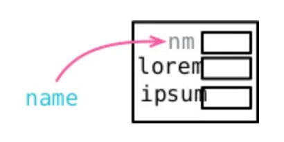
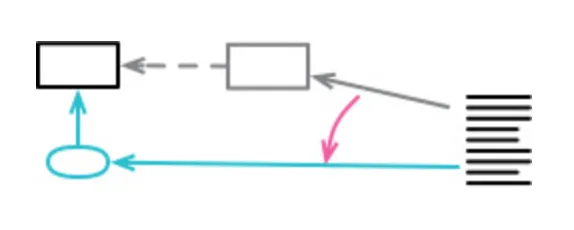
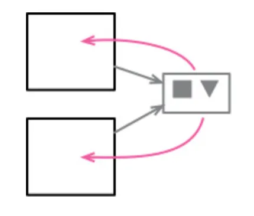
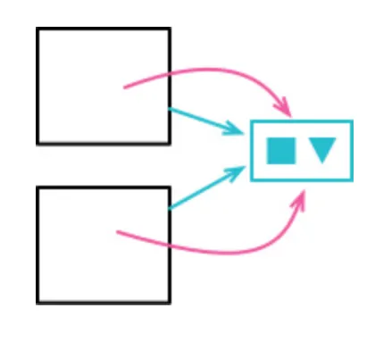
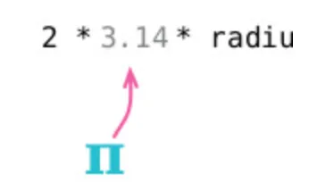

- 9.1 변수 쪼개기
  
  - 여러 번 대입하는 용도의 수집 변수가 아닌 이상 역할이 둘 이상인 변수가 있다면 쪼개야 한다
  - 여러 용도로 쓰인 변수는 코드를 읽을때 커다란 혼란을 주고 버그를 낳는다
  - 하나의 변수에 값이 여러 번 대입된다면 여러 역할을 수행한다는 신호이다
    - 단, 루프 변수, 수집 변수 등은 여러 번 대입은 자연스러울 수 있음 → 이것도 여러 역할을 수행하면 쪼갤것
  - 요점
    > 역할이 둘 이상인 변수가 있다면 쪼개야 한다. 예외는 없다. 역할 하나당 변수 하나다
  ```tsx
  // before
  let temp = 2 * (height + width);
  console.log(temp);
  temp = height * width;
  console.log(temp);

  //after
  const perimeter = 2 * (height + width);
  console.log(perimeter);
  const area = height * width;
  console.log(area);
  ```
- 9.2 필드 이름 바꾸기
  
  - 데이터 구조는 프로그램을 이해하는데 큰 역할을 하기 때문에 필드 이름은 중요하다
  - 중요한 만큼 반드시 깔끔하게 관리해야 하며 데이터를 잘 이해하게되면 프로그램에 반드시 반영해야 한다
  - 요점
    > 이름은 중요하다. 그리고 프로그램 곳곳에서 쓰이는 레코드 구조체의 필드 이름들은 특히 더 중요하다. 데이터 구조는 무슨 일이 벌어지는지를 이해하는 열쇠다
  ```tsx
  // before
  class Organization {
    get name() {...}
  }

  // after
  class Organization {
    get title() {...}
  }
  ```
- 9.3 파생 변수를 질의 함수로 바꾸기
  
  - 파생 변수(derived variable)
    - 다른 변수의 값으로부터 계산되는 변수를 의미
  - 가변 데이터는 서로 다른 두 코드를 이상한 방식으로 결합하기도 한다
  - 예컨대 한 쪽 코드에서 수정한 값이 연쇄 효과를 일으키는 경우 원인을 찾기 어려울 문제를 야기한다
  - 완전히 배제하기란 현실적으로 불가능해 유효 범위를 최대한 좁혀야 한다
  - 적용
    - 값을 쉽게 계산해낼 수 있는 변수들을 모두 제거하고 함수로 분리한다
    - 단, 새로운 데이터 구조를 생성하는 변형 연산이라면 그대로 두는 것도 괜찮다
  ```tsx
  // before -> adjustment 값을 적용할 때 production까지 갱신되는 문제 발생
  class ProductionPlan {
    get production() {
      return this._production;
    }
    applyAdjustment(adjustment) {
      this._adjustments.push(adjustment);
      this._production += adjustment.amount;
    }
  }

  // after -> 필요할 때 adjustments를 통해 값을 구하도록
  class ProductionPlan {
    get production() {
      return this._adjustments.reduce((sum, a) => sum + a.mount, 0);
    }
    applyAdjustment(adjustment) {
      this._adjustments.push(adjustment);
    }
  }
  ```
  - 효과
    - 코드 자체가 데이터의 의미를 더 분명히 드러낸다
    - 변경된 값을 실수로 결과 변수에 반영하지 않는 등의 실수를 방지한다
- 9.4 참조를 값으로 바꾸기
  
  - 값: 값 그 자체, 불변성, 원시 타입 = a = 1; 에서 1을 바꿀 순 없다 a에 2라는 값을 재할당할 순 있다
  - 참조: 가변성 = object, 내부 객체는 그대로 둔 채 그 객체의 속성만 갱신
    - 값으로 다루는 경우에는 새로운 속성을 담은 객체로 기존 내부 객체를 통째로 대체
  - 객체의 상태를 여러 곳에서 공유되지 않을 때
  ```tsx
  // before
  class Person {
    constructor() {
      this._telephoneNumber = new TelephoneNumber();
    }

    get officeAreaCode() {
      return this._telephoneNumber.areaCode;
    }
    set officeAreaCode(arg) {
      this._telephoneNumber.areaCode = arg;
    }
    get officeNumber() {
      return this._telephoneNumber.number;
    }
    set officeNumber(arg) {
      this._telephoneNumber.number = arg;
    }
  }

  class TelephoneNumber {
    get areaCode() {
      return this._areaCode;
    }
    set areaCode(arg) {
      this._areaCode = arg;
    }
    get number() {
      return this._number;
    }
    set number(arg) {
      this._number = arg;
    }
  }

  // using
  const person1 = new Person();
  const person2 = new Person();

  // 두 Person 객체가 동일한 TelephoneNumber 객체를 공유한다고 가정
  person1.officeAreaCode = "123";
  person1.officeNumber = "4567890";

  person2.officeAreaCode = "987";
  person2.officeNumber = "6543210";

  // person1의 전화번호를 출력하면?
  console.log(person1.officeAreaCode); // "987" (문제 발생)
  console.log(person1.officeNumber); // "6543210" (문제 발생)
  ```
  ```tsx
  // after
  class Person {
    constructor() {
      this._telephoneNumber = new TelephoneNumber();
    }

    get officeAreaCode() {
      return this._telephoneNumber.areaCode;
    }
    set officeAreaCode(arg) {
      // 새로운 TelephoneNumber 객체를 생성하여 할당
      this._telephoneNumber = new TelephoneNumber(arg, this.officeNumber);
    }
    get officeNumber() {
      return this._telephoneNumber.number;
    }
    set officeNumber(arg) {
      this._telephoneNumber.number = new TelephoneNumber(
        this.officeAreaCode,
        arg
      );
    }
  }

  class TelephoneNumber {
    get areaCode(areaCode, number) {
      this._areaCode = areaCode;
      this._number = number;
    }
    get number() {
      return this._number;
    }
  }

  // using
  const person1 = new Person();
  const person2 = new Person();

  // person1과 person2는 서로 다른 TelephoneNumber 객체를 가짐
  person1.officeAreaCode = "123";
  person1.officeNumber = "4567890";

  person2.officeAreaCode = "987";
  person2.officeNumber = "6543210";

  // person1의 전화번호를 출력하면?
  console.log(person1.officeAreaCode); // "123" (문제 없음)
  console.log(person1.officeNumber); // "4567890" (문제 없음)
  ```
  - 효과
    - 값을 복제해 이곳저곳에서 사용하더라도 서로 간의 참조를 관리하지 않아도 된다
    - 분산 시스템과 동시성 시스템에서 특이 유용하다
- 9.5 값을 참조로 바꾸기
  
  - 바로 앞 절과 반대의 상황
  - 객체의 상태를 여러 곳에서 공유하고, 그 값이 갱신되어야 한다면 해당 객체의 참조를 유지하는 것이 좋음
  - 클라이언트들이 지속적으로 하나의 객체를 참조할 수 있도록 단일한 저장소(객체) 만들기
  - 요점
    > 논리적으로 같은 데이터를 물리적으로 복제해 사용할 때 가장 크게 문제되는 상황은 그 데이터를 갱신해야 되서 모든 복제본을 찾아서 빠짐없이 갱신할 때이다
    > 차라리, 복제된 데이터들을 모두 참조로 바꿔주는 게 좋다
  - 적용시점
    - 데이터를 하나로 사용해야 하는 경우
  ```tsx
  // before
  class Product {
    private _price: number;

    constructor(price: number) {
      this._price = price;
    }

    get price() { return this._price; }
    set price(newPrice: number) { this._price = newPrice; }
  }

  class CartItem {
    private _product: Product;
    private _quantity: number;

    constructor(product: Product, quantity: number) {
      // 독립적인 Product 인스턴스 생성
      this._product = new Product(product.price);
      this._quantity = quantity;
    }

    get totalPrice() { return this._product.price * this._quantity; }
    set productPrice(newPrice: number) {
  		// 독립적인 Product 인스턴스의 가격을 변경
  	  this._product.price = newPrice;
  	}

  // using
  const product = new Product(100);
  const cartItem1 = new CartItem(product, 2);
  const cartItem2 = new CartItem(product, 3);

  // cartItem1의 가격을 변경해도 cartItem2에는 영향을 미치지 않음
  cartItem1.productPrice = 120;

  console.log(cartItem1.totalPrice); // 240 (120 * 2)
  console.log(cartItem2.totalPrice); // 300 (100 * 3) => 일관성 문제
  ```
  ```tsx
  // after
  class Product {
    private _price: number;

    constructor(price: number) {
      this._price = price;
    }

    get price() {
      return this._price;
    }
    set price(newPrice: number) {
      this._price = newPrice;
    }
  }

  class CartItem {
    private _product: Product;
    private _quantity: number;

    constructor(product: Product, quantity: number) {
      // 동일한 Product 인스턴스를 참조
      this._product = product;
      this._quantity = quantity;
    }

    get totalPrice() {
      return this._product.price * this._quantity;
    }
  }

  // using
  const product = new Product(100);
  const cartItem1 = new CartItem(product, 2);
  const cartItem2 = new CartItem(product, 3);

  // cartItem1의 가격을 변경하면 cartItem2에도 영향을 미침
  product.price = 120;

  console.log(cartItem1.totalPrice); // 240 (120 * 2)
  console.log(cartItem2.totalPrice); // 360 (120 * 3) => 일관성 유지
  ```
  - 효과
    - 갱신이 필요할 때 모든 복제본을 찾아서 빠짐없이 갱신하는 처리를 하지 않아도 된다
- 9.6 매직 리터럴 바꾸기 (Replace Magic Literal)
  
  - 매직 리터럴이란 소스 코드에 등장하는 일반적인 리터럴 값을 말한다
  - 코드를 읽는 사람이 그 값의 의미를 모른다면 코드로는 의미를 명확히 알려주지 못하고 각자의 해석이 필요하게 된다
  - 웬만하면 매직 리터럴을 상수로 따로 선언
  ```tsx
  // before
  function areaOfCircle(r) {
    return r * r * 3.14;
  }

  // after
  const PERIMETER = 3.14;

  function areaOfCircle(r) {
    return r * r * PERIMETER;
  }
  ```
  - 효과
    - 코드 자체가 뜻을 분명하게 드러낼 수 있다
  - 설계 레이어나 코드를 보여줘도 혼란스러울 수 있지만 데이터 테이블 구조를 제공한다면 훨씬 빠르게 그 전체 구조를 파악할 것이다
