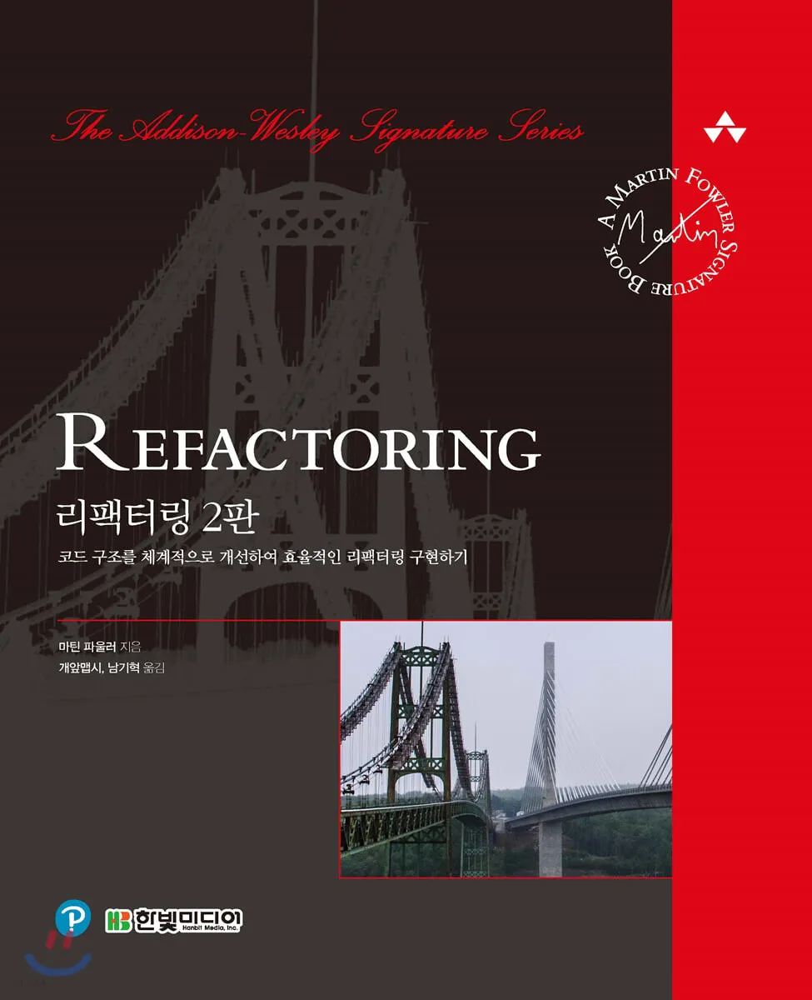

# refactoring-study

## 목표

- 코드를 이해하기 쉽게 만들고 가독성을 향상시켜서 버그 픽스 및 유지보수에 효율적인 코드 구현을 학습
- 새로운 개발자 누가와도 코드를 보고 이해할 수 있도록 하여 생산성을 증가시킬 수 있는 능력 향상

## 발표 방식

- 챕터 내에서 소제목 기준으로 파트를 나눠 `각 파트당 1명의 발표자`를 정하고 `다른 팀원들이 질문`을 하는 방식
  - 소제목: 각 챕터 내의 소분류 단위(분량에 따라서 할당되는 소분류 단위가 다를 수 있음)
  - 각자 할당된 분량에 대해 요약 or 핵심 부분을 정리하여 스터디 시간에 공유
  - 본인의 분량이 아니더라도 해당 주의 모든 내용은 전체 읽어오기

## 진행예정

1. 분량에 따라 `한주에 챕터 1개`만 할 수 있도록 하되 나눌 내용이 없으면 요약만 하고 간단하게 넘어간다
2. `무조건 한주에 챕터는 2개씩` 하여 개인이 충분히 정리할 만한 내용이 되도록 한주에 읽을 분량을 늘린다🙇‍♂️
